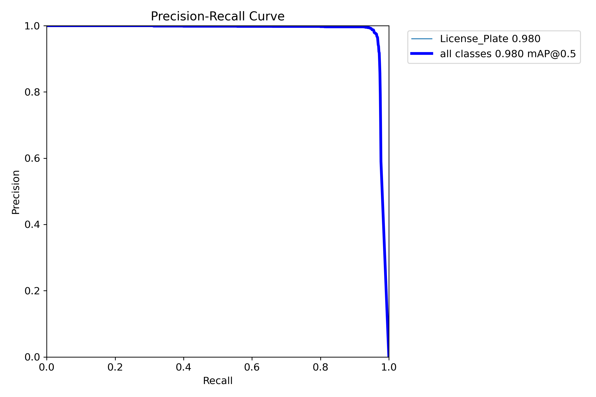
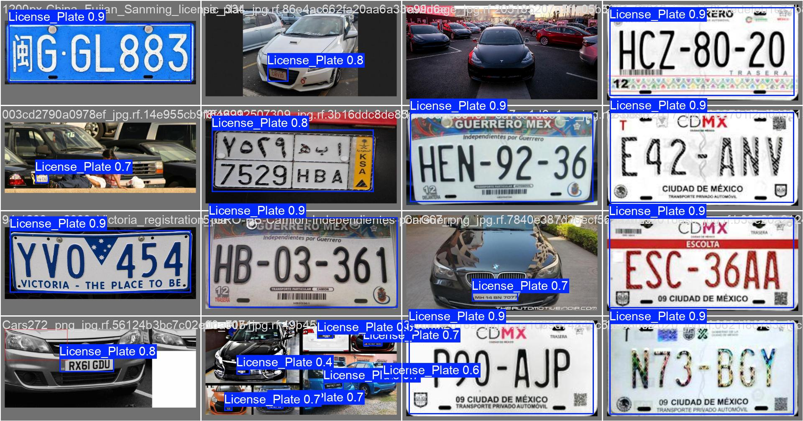
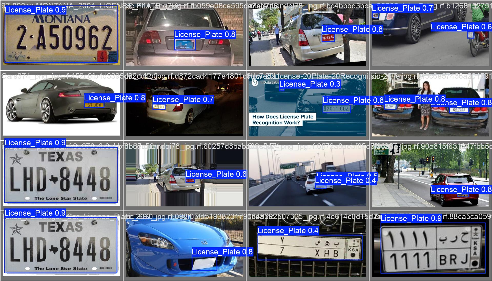

# 📘 [เวอร์ชั่นภาษาไทยที่นี่](README.md)

# YOLOv11-License-Plate Detection

This model is fine-tuned from various YOLOv11 versions (n, s, m, l, x) using a dataset from Roboflow Universe:  
[License Plate Recognition Dataset (10,125 images)](https://universe.roboflow.com/roboflow-universe-projects/license-plate-recognition-rxg4e/dataset/11)  
to save time and cost for developers who need a fast and accurate license plate detection model.

## 🔥 YOLOv11-License-Plate Performance

| Model     | Precision | Recall  | mAP@50  | mAP@50-95 | Box Loss  | Class Loss  | Epoch |
|-----------|-----------|---------|---------|-----------|-----------|-------------|--------|
| YOLOv11n  | 0.98350   | 0.95054 | 0.97856 | 0.72303   | 1.03004   | 0.37652     | 94     |
| YOLOv11s  | 0.97585   | 0.95444 | 0.97828 | 0.72970   | 1.02842   | 0.35631     | 119    |
| YOLOv11m  | 0.97750   | 0.95854 | 0.97964 | 0.73273   | 1.02907   | 0.35829     | 92     |
| YOLOv11l  | 0.98326   | 0.95945 | 0.98111 | 0.73178   | 1.03286   | 0.35499     | 101    |
| YOLOv11x  | 0.98729   | 0.95514 | 0.98035 | 0.73118   | 1.03362   | 0.36342     | 88     |

> Notes:  
> - **Precision**: Detection accuracy  
> - **Recall**: Detection coverage  
> - **mAP@50**: Mean Average Precision at IoU ≥ 50%  
> - **mAP@50-95**: Mean Average Precision across multiple IoUs  
> - **Box Loss / Class Loss**: Loss functions during training

### 🧠 Model Selection Guide

- **`YOLOv11n`** – Ultra-lightweight, ideal for edge devices (Jetson, Raspberry Pi)
- **`YOLOv11s`** – Fast and efficient for real-time inference on CPU
- **`YOLOv11m`** – Best balance of accuracy and performance for most use cases
- **`YOLOv11l`** – High accuracy for demanding applications (LPR, security)
- **`YOLOv11x`** – Maximum precision, recommended for GPU-powered systems

> `.pt` is for Python and Ultralytics CLI (`yolo task=detect`)  
> `.onnx` is for other inference systems such as OpenCV DNN, TensorRT, or ONNXRuntime

## Model

### PyTorch Format (.pt)
- [`license-plate-finetune-v1n.pt`](https://github.com/morsetechlab/yolov11-license-plate-detection/releases/download/v1.0.0/license-plate-finetune-v1n.pt)
- [`license-plate-finetune-v1s.pt`](https://github.com/morsetechlab/yolov11-license-plate-detection/releases/download/v1.0.0/license-plate-finetune-v1s.pt)
- [`license-plate-finetune-v1m.pt`](https://github.com/morsetechlab/yolov11-license-plate-detection/releases/download/v1.0.0/license-plate-finetune-v1m.pt)
- [`license-plate-finetune-v1l.pt`](https://github.com/morsetechlab/yolov11-license-plate-detection/releases/download/v1.0.0/license-plate-finetune-v1l.pt)
- [`license-plate-finetune-v1x.pt`](https://github.com/morsetechlab/yolov11-license-plate-detection/releases/download/v1.0.0/license-plate-finetune-v1x.pt)

### ONNX Format (.onnx)
- [`license-plate-finetune-v1n.onnx`](https://github.com/morsetechlab/yolov11-license-plate-detection/releases/download/v1.0.0/license-plate-finetune-v1n.onnx)
- [`license-plate-finetune-v1s.onnx`](https://github.com/morsetechlab/yolov11-license-plate-detection/releases/download/v1.0.0/license-plate-finetune-v1s.onnx)
- [`license-plate-finetune-v1m.onnx`](https://github.com/morsetechlab/yolov11-license-plate-detection/releases/download/v1.0.0/license-plate-finetune-v1m.onnx)
- [`license-plate-finetune-v1l.onnx`](https://github.com/morsetechlab/yolov11-license-plate-detection/releases/download/v1.0.0/license-plate-finetune-v1l.onnx)
- [`license-plate-finetune-v1x.onnx`](https://github.com/morsetechlab/yolov11-license-plate-detection/releases/download/v1.0.0/license-plate-finetune-v1x.onnx)

## 🤗 Hugging Face

Hugging Face Hub 👉 [https://huggingface.co/morsetechlab/yolov11-license-plate-detection](https://huggingface.co/morsetechlab/yolov11-license-plate-detection)

#### PyTorch (.pt)
```bash
wget https://huggingface.co/morsetechlab/yolov11-license-plate-detection/resolve/main/lpr-finetune-v1x.pt
```

#### ONNX (.onnx)
```bash
wget https://huggingface.co/morsetechlab/yolov11-license-plate-detection/resolve/main/lpr-finetune-v1x.onnx
```

### Download with `hf_hub_download` (ideal for Jetson, Raspberry Pi)

```python
from huggingface_hub import hf_hub_download

# PyTorch (.pt)
model_path = hf_hub_download(
    repo_id="morsetechlab/yolov11-license-plate-detection",
    filename="license-plate-finetune-v1n.pt"
)

# ONNX (.onnx)
onnx_path = hf_hub_download(
    repo_id="morsetechlab/yolov11-license-plate-detection",
    filename="license-plate-finetune-v1n.onnx"
)
```

> - Supports automatic caching,
> - Lightweight and efficient for resource-constrained edge devices
> - Compatible with Jetson Nano, Raspberry Pi, and other ARM-based boards


## Training Pipeline
```python
from ultralytics import YOLO

model = YOLO("yolo11n.pt")

model.train(
    data=f"{base_path}/data.yaml",
    epochs=300,
    imgsz=640,
    batch=16,
    name="license-plate-finetune-v1n",
    device=0, # GPU
    patience=15, # early stopping if not improve
    workers=2,
    val=True
)
```

## Export to ONNX
```python
from ultralytics import YOLO

model = YOLO(model_path)

# export
result = model.export(format="onnx", dynamic=True, simplify=True)
```

## Inference


<p align="center">
  
</p>

### Detect on Command Line (`inference-cli.py`)
```bash
python inference-cli.py \
--model yolov11n-license-plate.pt \
--source examples/plate.jpg \
--conf 0.25 \
--imgsz 1280
```
> Detects license plate from image via CLI and saves to `output/cli_inference_result.jpg`

### Detect with PyTorch (Ultralytics Python API)
```python
import os
import cv2
import numpy as np
from ultralytics import YOLO

# Define the path to the input image
image_dir = "images"
image_file = "cars.jpg"
image_path = os.path.join(image_dir, image_file)

# Load the fine-tuned YOLOv11 model
model = YOLO("yolov11x-license-plate.pt")

# Load the image using OpenCV
original_image = cv2.imread(image_path)

# Verify that the image was loaded successfully
if original_image is None:
    raise FileNotFoundError(f"File {image_path} is not found")

# Convert image from BGR (OpenCV) to RGB (Ultralytics)
image_rgb = cv2.cvtColor(original_image, cv2.COLOR_BGR2RGB)

# Run inference
results = model.predict(
    source=image_rgb,
    conf=0.25,
    imgsz=1280,
    save=False,
    show=False
)

# Draw detection results on the original image
for r in results:
    for box in r.boxes:
        x1, y1, x2, y2 = map(int, box.xyxy[0])
        conf = box.conf[0]
        label = r.names[int(box.cls[0])]

        cv2.rectangle(original_image, (x1, y1), (x2, y2), (0, 255, 0), 2)
        cv2.putText(original_image, f"{label} {conf:.2f}", (x1, y1 - 10),
                    cv2.FONT_HERSHEY_SIMPLEX, 0.6, (255, 255, 255), 2)

# Display the result
cv2.imshow("YOLOv11 License Plate Detection", original_image)
cv2.waitKey(0)
cv2.destroyAllWindows()

# Save the result image
output_path = os.path.join("output", "inference_result.jpg")
os.makedirs("output", exist_ok=True)
cv2.imwrite(output_path, original_image)
print(f"output: {output_path}")
```

### Detect with ONNX (ONNX Runtime)
```python
import onnxruntime as ort
import numpy as np
import cv2

# Load the input image
image_path = "images/cars.jpg"
image_bgr = cv2.imread(image_path)

if image_bgr is None:
    raise FileNotFoundError(f"File {image_path} is not found")

# Preprocess: Resize the image to 640x640 as required by YOLOv11
resized = cv2.resize(image_bgr, (640, 640))
input_tensor = resized.transpose(2, 0, 1)[np.newaxis].astype(np.float32) / 255.0

# Load ONNX model
session = ort.InferenceSession("yolov11n-license-plate.onnx")
input_name = session.get_inputs()[0].name

# Run inference
outputs = session.run(None, {input_name: input_tensor})

# outputs[0] contains the raw detection results, further post-processing (e.g., NMS) is needed
```

## Results

**The results shown below are from the `license-plate-finetune-v1x` model, which achieved the highest performance among all models we trained.**  
You can explore results from other models at  
[`/detect`](detect)

### PR Curve (Precision-Recall)



### Training Losses and mAP over time


### Confusion Matrix


### Validation Batches

  
  


## requirements.txt
```txt
ultralytics
onnxruntime
opencv-python
matplotlib
pandas
```

## ALPR Use with OCR for Reading License Plates

This model only **detects** the license plate region. For **reading characters**, pair it with OCR tools such as:
- [EasyOCR](https://github.com/JaidedAI/EasyOCR)
- [Tesseract OCR](https://github.com/tesseract-ocr/tesseract)
- [PaddleOCR](https://github.com/PaddlePaddle/PaddleOCR)

## 💡 Real-World Applications
- Smart Parking Systems
- Tollgate / Access Control
- Traffic Surveillance Cameras
- License Plate-based Vehicle Tracking

## Attribution

- **Open source computer vision library** [OpenCV](https://github.com/opencv/opencv)
- **YOLOv11** [Ultralytics](https://github.com/ultralytics/ultralytics)  
- **Dataset** [Roboflow Universe](https://universe.roboflow.com/roboflow-universe-projects/license-plate-recognition-rxg4e)
- **Fine-Tuned, evaluated, and packaged** [MorseTech Lab](https://www.morsetechlab.com)

## 🛡️ License

This project is licensed under the [GNU Affero General Public License v3.0 (AGPLv3)](LICENSE), in order to comply with the licenses of core dependencies used in this project