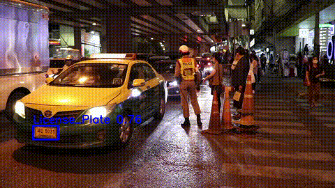

# 📘 [English version available here](README.en.md)

# YOLOv11-License-Plate Detection (โมเดลตรวจจับป้ายทะเบียน)

โมเดลนี้ถูก Fine-Tune มาจาก YOLOv11 รุ่นต่าง ๆ (n, s, m, l, x) โดยใช้ Dataset จาก Roboflow Universe:  
[License Plate Recognition Dataset (10,125 ภาพ)](https://universe.roboflow.com/roboflow-universe-projects/license-plate-recognition-rxg4e/dataset/11)  
เพื่อช่วยลดเวลาและต้นทุนในการฝึกโมเดลสำหรับผู้ที่ต้องการใช้งานระบบตรวจจับแผ่นป้ายทะเบียนแบบรวดเร็วและแม่นยำ

## 🔥 ประสิทธิภาพของ YOLOv11-License-Plate

| โมเดล     | Precision | Recall  | mAP@50  | mAP@50-95 | Box Loss  | Class Loss  |
|-----------|-----------|---------|---------|-----------|-----------|-------------|
| YOLOv11n  | 0.9835    | 0.9505  | 0.9786  | 0.723     | 1.0300    | 0.3765      |
| YOLOv11s  | 0.9831    | 0.9524  | 0.9794  | 0.7285    | 1.0274    | 0.3576      |
| YOLOv11m  | 0.9831    | 0.9553  | 0.9805  | 0.7301    | 1.0295    | 0.3519      |
| YOLOv11l  | 0.9836    | 0.9608  | 0.9826  | 0.7307    | 1.0338    | 0.3481      |
| YOLOv11x  | 0.9893    | 0.9508  | 0.9813  | 0.7260    | 1.0364    | 0.3661      |

> หมายเหตุ:  
> - **Precision**: ความแม่นยำในการตรวจจับ  
> - **Recall**: ความครอบคลุมของการตรวจจับ  
> - **mAP@50**: ค่าความแม่นยำเฉลี่ยเมื่อ IoU ≥ 50%  
> - **mAP@50-95**: ค่าความแม่นยำเฉลี่ยทุกระดับ IoU  
> - **Box Loss / Class Loss**: ความสูญเสียระหว่างการเรียนรู้ (loss functions)

**คำแนะนำการใช้งาน:**

- `YOLOv11n` – เบาสุด เหมาะกับ **Jetson Nano, Raspberry Pi, CPU**
- `YOLOv11s` – เบา + แม่นดี ใช้ได้กับ **อุปกรณ์ Edge**
- `YOLOv11m` – สมดุล เหมาะกับ **PC/Server ที่ไม่ใช้ GPU**
- `YOLOv11l` – แม่นสุด เหมาะกับ **Cloud หรือ GPU Desktop**
- `YOLOv11x` – แม่น + Precision สูง เหมาะกับ **Cloud GPU เท่านั้น**

> `.pt` สำหรับใช้กับ Python และ CLI ของ Ultralytics (เช่น `yolo task=detect`) 
> `.onnx` สำหรับใช้งานในระบบ inference อื่น เช่น OpenCV DNN, TensorRT, ONNXRuntime

## Model

### PyTorch Format (.pt)
- [`license-plate-finetune-v1n.pt`](https://github.com/morsetechlab/yolov11-license-plate-detection/releases/download/v1.0.0/license-plate-finetune-v1n.pt)
- [`license-plate-finetune-v1s.pt`](https://github.com/morsetechlab/yolov11-license-plate-detection/releases/download/v1.0.0/license-plate-finetune-v1s.pt)
- [`license-plate-finetune-v1m.pt`](https://github.com/morsetechlab/yolov11-license-plate-detection/releases/download/v1.0.0/license-plate-finetune-v1m.pt)
- [`license-plate-finetune-v1l.pt`](https://github.com/morsetechlab/yolov11-license-plate-detection/releases/download/v1.0.0/license-plate-finetune-v1l.pt)
- [`license-plate-finetune-v1x.pt`](https://github.com/morsetechlab/yolov11-license-plate-detection/releases/download/v1.0.0/license-plate-finetune-v1x.pt)

### ONNX Format (.onnx)
- [`license-plate-finetune-v1n.onnx`](https://github.com/morsetechlab/yolov11-license-plate-detection/releases/download/v1.0.0/license-plate-finetune-v1n.onnx)
- [`license-plate-finetune-v1s.onnx`](https://github.com/morsetechlab/yolov11-license-plate-detection/releases/download/v1.0.0/license-plate-finetune-v1s.onnx)
- [`license-plate-finetune-v1m.onnx`](https://github.com/morsetechlab/yolov11-license-plate-detection/releases/download/v1.0.0/license-plate-finetune-v1m.onnx)
- [`license-plate-finetune-v1l.onnx`](https://github.com/morsetechlab/yolov11-license-plate-detection/releases/download/v1.0.0/license-plate-finetune-v1l.onnx)
- [`license-plate-finetune-v1x.onnx`](https://github.com/morsetechlab/yolov11-license-plate-detection/releases/download/v1.0.0/license-plate-finetune-v1x.onnx)

## 🤗 Hugging Face

Hugging Face Hub 👉 [https://huggingface.co/morsetechlab/yolov11-license-plate-detection](https://huggingface.co/morsetechlab/yolov11-license-plate-detection)

#### PyTorch (.pt)

```bash
wget https://huggingface.co/morsetechlab/yolov11-license-plate-detection/resolve/main/lpr-finetune-v1x.pt
```

#### ONNX (.onnx)

```bash
wget https://huggingface.co/morsetechlab/yolov11-license-plate-detection/resolve/main/lpr-finetune-v1x.onnx
```

### ดาวน์โหลดด้วย `hf_hub_download` (เหมาะกับ Jetson, Raspberry Pi)

```python
from huggingface_hub import hf_hub_download

# PyTorch (.pt)
model_path = hf_hub_download(
    repo_id="morsetechlab/yolov11-license-plate-detection",
    filename="license-plate-finetune-v1n.pt"
)

# ONNX (.onnx)
onnx_path = hf_hub_download(
    repo_id="morsetechlab/yolov11-license-plate-detection",
    filename="license-plate-finetune-v1n.onnx"
)
```

> - รองรับระบบแคชอัตโนมัติ  
> - ประหยัดทรัพยากร เหมาะกับอุปกรณ์ edge ที่สเปกจำกัด  
> - ใช้งานได้กับ Jetson Nano, Raspberry Pi, และบอร์ด ARM อื่น ๆ


## Training Pipeline
```python
from ultralytics import YOLO

model = YOLO("yolo11n.pt")

model.train(
    data=f"{base_path}/data.yaml",
    epochs=300,
    imgsz=640,
    batch=16,
    name="license-plate-finetune-v1n",
    device=0, # GPU
    patience=15, # early stopping if not improve
    workers=2,
    val=True
)
```

## Export to ONNX
```python
from ultralytics import YOLO

model = YOLO(model_path)

# export
result = model.export(format="onnx", dynamic=True, simplify=True)
```

## Inference


<p align="center">
  
</p>

### Detect on Command Line (`inference-cli.py`)
```bash
python inference-cli.py \
--model yolov11n-license-plate.pt \
--source examples/plate.jpg \
--conf 0.25 \
--imgsz 1280
```
> ตรวจจับจากภาพที่ระบุผ่าน CLI และบันทึกผลลัพธ์ไว้ที่ `output/cli_inference_result.jpg`

### Detect on PyTorch (Ultralytics Python API)
```python

import os
import cv2
import numpy as np
from ultralytics import YOLO

# กำหนด path ของไฟล์ภาพ
image_dir = "images"
image_file = "cars.jpg"
image_path = os.path.join(image_dir, image_file)

# โหลดโมเดล YOLOv11 ที่ fine-tune แล้ว
model = YOLO("yolov11x-license-plate.pt")

# โหลดภาพด้วย OpenCV
original_image = cv2.imread(image_path)

# ตรวจสอบว่าภาพโหลดสำเร็จหรือไม่
if original_image is None:
    raise FileNotFoundError(f"File {image_path} is not found")

# แปลงจาก BGR เป็น RGB
image_rgb = cv2.cvtColor(original_image, cv2.COLOR_BGR2RGB)

# ทำ Inference
results = model.predict(
    source=image_rgb,
    conf=0.25,
    imgsz=1280,
    save=False,
    show=False
)

# วาดผลลัพธ์บนภาพต้นฉบับ
for r in results:
    for box in r.boxes:
        x1, y1, x2, y2 = map(int, box.xyxy[0])
        conf = box.conf[0]
        label = r.names[int(box.cls[0])]

        cv2.rectangle(original_image, (x1, y1), (x2, y2), (0, 255, 0), 2)
        cv2.putText(original_image, f"{label} {conf:.2f}", (x1, y1 - 10),
                    cv2.FONT_HERSHEY_SIMPLEX, 0.6, (255, 255, 255), 2)

# แสดงผลลัพธ์
cv2.imshow("YOLOv11 License Plate Detection", original_image)
cv2.waitKey(0)
cv2.destroyAllWindows()

# บันทึกภาพผลลัพธ์
output_path = os.path.join("output", "inference_result.jpg")
os.makedirs("output", exist_ok=True)
cv2.imwrite(output_path, original_image)
print(f"output: {output_path}")
```

### Detect on ONNX (ONNX Runtime)
```python
import onnxruntime as ort
import numpy as np
import cv2

# โหลดรูปภาพ
image_path = "images/cars.jpg"
image_bgr = cv2.imread(image_path)

if image_bgr is None:
    raise FileNotFoundError(f"File {image_path} is not found")

# pre-processing
resized = cv2.resize(image_bgr, (640, 640)) # Resize ภาพให้มีขนาด 640x640 (ตามที่ YOLOv11 ใช้)
input_tensor = resized.transpose(2, 0, 1)[np.newaxis].astype(np.float32) / 255.0

# โหลดโมเดล ONNX
session = ort.InferenceSession("yolov11n-license-plate.onnx")
input_name = session.get_inputs()[0].name

# ทำ Inference
outputs = session.run(None, {input_name: input_tensor})

# outputs[0] จะเป็นผลลัพธ์ที่ต้อง post-process ต่อ เช่น NMS
```

## Results

### PR Curve (Precision-Recall)


### Losses และ mAP ตลอดการฝึก


### Confusion Matrix


### Validation Batch


## requirements.txt
```txt
ultralytics
onnxruntime
opencv-python
matplotlib
pandas
```

## การประยุกต์ใช้ในงาน ALPR ด้วย OCR สำหรับอ่านป้ายทะเบียนอัตโนมัติ

โมเดลนี้ทำหน้าที่ “ตรวจจับ” ตำแหน่งป้ายทะเบียนเท่านั้น หากต้องการ “อ่านตัวอักษร” บนป้าย ให้ใช้ OCR ร่วม เช่น:
- [EasyOCR](https://github.com/JaidedAI/EasyOCR)
- [Tesseract OCR](https://github.com/tesseract-ocr/tesseract)
- [PaddleOCR](https://github.com/PaddlePaddle/PaddleOCR)

## 💡 ตัวอย่างการนำไปใช้งาน Real-World Application
- ระบบจอดรถอัจฉริยะ (Smart Parking)
- ระบบประตูอัตโนมัติ (Tollgate / Access Control)
- กล้องตรวจสอบการจราจร
- ระบบติดตามรถตามหมายเลขทะเบียน

## Attribution

- **Open source computer vision library** [OpenCV](https://github.com/opencv/opencv)
- **YOLOv11** [Ultralytics](https://github.com/ultralytics/ultralytics)  
- **Dataset** [Roboflow Universe](https://universe.roboflow.com/roboflow-universe-projects/license-plate-recognition-rxg4e)
- **Fine-Tuned, evaluated, and packaged** [MorseTech Lab](https://www.morsetechlab.com)

## 🛡️ License

Project นี้เผยแพร่ภายใต้ [GNU Affero General Public License v3.0 (AGPLv3)](LICENSE) เพื่อให้สอดคล้องกับเงื่อนไขการใช้งานของไลบรารีที่เกี่ยวข้อง